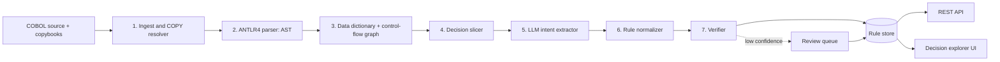
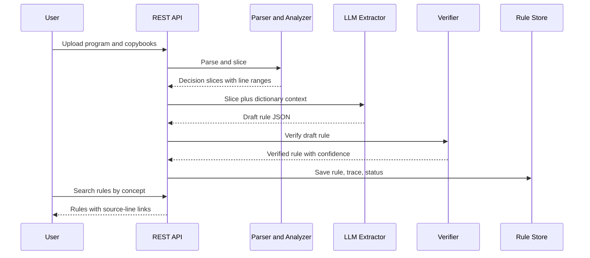

# Architecture

## 1. Design principles
1. **Source in, decision model out.** Only COBOL source and copybooks are read. No transaction or customer data enters the pipeline.
2. **Hybrid, not LLM-only.** Deterministic parsing and static analysis find the decision structure. The LLM adds meaning (intent, naming), and symbolic checks keep it honest.
3. **Every rule is traceable.** Each rule links to program, copybook and exact line range.
4. **Human in the loop.** Low-confidence rules go to a review queue. Nothing is published as approved without verification or reviewer sign-off.
5. **Runs where the code lives.** All components, including LLM inference, run on-premises with zero data egress.

## 2. System overview

## 3. Components

| # | Component | Responsibility | Technology |
|---|---|---|---|
| 1 | Ingest | Load programs and copybooks, resolve `COPY ... REPLACING`, record file origin and line mapping | Python |
| 2 | Parser | Parse DATA and PROCEDURE DIVISIONs into an AST | ANTLR4 COBOL grammar |
| 3 | Analyzer | Build symbol table and data dictionary (PIC, USAGE, REDEFINES, OCCURS, 88-levels) and control-flow graph | Python |
| 4 | Decision slicer | Locate IF, EVALUATE and condition chains, and slice the statements they control (MOVE, COMPUTE, CALL, PERFORM, WRITE) | AST/CFG traversal |
| 5 | LLM extractor | Convert each slice plus its data-dictionary context into a plain-English intent and a draft structured rule | Fine-tuned LLaMA/DeepSeek, retrieval over dictionary, schema-constrained output |
| 6 | Normalizer | Convert draft rules to the canonical schema (see [rules.md](rules.md)) | Python |
| 7 | Verifier | Symbolic comparison with AST predicate, differential testing on generated inputs, confidence scoring | GnuCOBOL, Python |
| 8 | Rule store | Versioned storage of rules, traces, review state | SQLite/PostgreSQL |
| 9 | REST API | Search, retrieve, review, export and score | FastAPI, OpenAPI |
| 10 | Decision explorer | Query rules by business concept, view source side by side, review and approve | Web UI |
| 11 | Explainability | SHAP on a surrogate model built from replayed synthetic decisions, to show feature influence | SHAP |

## 4. Processing flow

## 5. Deployment
- **Target:** IBM Z Open Platform / LinuxONE, in the same environment as the COBOL source.
- **Packaging:** containers, one per service (analysis, LLM inference, API, UI).
- **Demo fallback:** the same containers run on any local Linux machine.
- **Network:** no outbound calls. Model weights are loaded locally. The API is reachable only inside the institution's network.

## 6. Key design decisions

| Decision | Choice | Reason |
|---|---|---|
| Parser vs LLM for structure | Parser finds structure, LLM explains it | Parsers are exact on syntax; LLMs are strong on intent but can hallucinate |
| Canonical format | JSON rule schema, with decision-tree JSON and PMML exports | JSON is easy to query and review; PMML gives interoperability for tree-shaped rules |
| Inference location | Local model | Source code is confidential; zero data egress |
| Trust model | Verify, then score confidence, then review | Keeps unverified rules out of the approved set |
| Unit of extraction | One decision slice per rule | Small context fits the model and keeps trace ranges precise |

## 7. Known limitations and risks
- Dialect and copybook variations: start with a defined COBOL subset and extend the grammar iteratively.
- Rules that depend on external calls (CICS, DB2, called programs) are marked `external_dependency` rather than guessed.
- GO TO-heavy legacy code can fragment slices; the slicer follows the CFG but may flag these for review.
- LLM output quality depends on fine-tuning data; the synthetic corpus plus gold standard is used to measure this ([evaluation.md](evaluation.md)).
